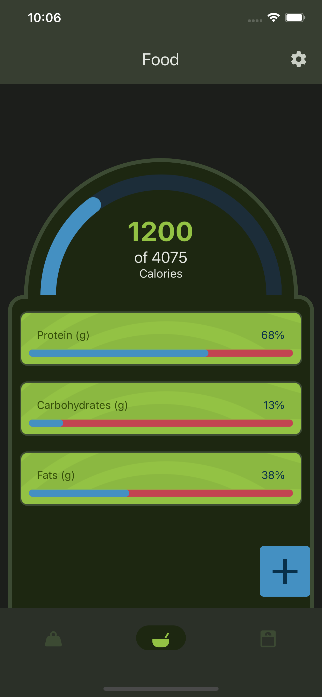
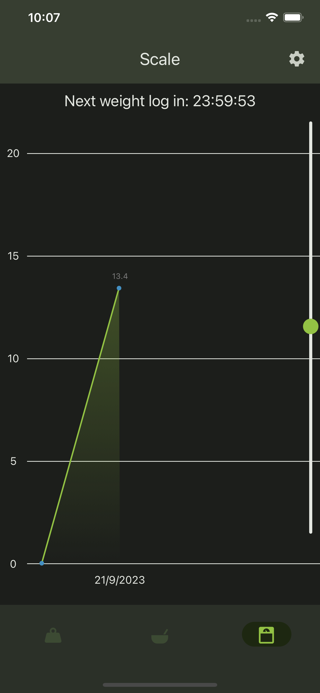

# Gojim Fitness App

Gojim is a comprehensive fitness app designed to help you track your workouts and calories, allowing you to stay motivated and achieve your fitness goals. With Gojim, you can easily monitor your progress, record your exercises, and keep an eye on your calorie intake.

## Features

- **Workout Tracking**: Gojim empowers you to take control of your fitness journey with its comprehensive workout tracking feature. Effortlessly log each exercise, sets, and reps, and record the weight and duration of your workouts. It's the ultimate tool to monitor your progress over time, helping you stay accountable and motivated.

- **Calorie Counter**: Achieving your fitness goals requires more than just exercise; it's also about nutrition. With Gojim's integrated Calorie Counter, you can easily monitor your daily calorie intake and set targets aligned with your fitness objectives. Our extensive database, powered by [Open Food Facts](https://openfoodfacts.org), simplifies calorie tracking by providing nutritional information for a wide range of common food items. Say goodbye to guesswork and hello to precision in your diet planning.

- **Progress Insights**: Gojim goes beyond tracking by providing you with valuable insights into your fitness journey. Our app generates detailed reports and intuitive graphs that visualize your progress. Dive into your performance history, and gain the knowledge you need to make informed decisions about your fitness routine. With Gojim, you're not just working out; you're working smart. Elevate your fitness game and achieve your goals with confidence.

## Screenshots

  
  
  
  

## Technologies Used

- React Native: A JavaScript library for building user interfaces.
- Expo: React native framework for testing and distrubition
- SQLite and AsyncStorage: Storing all user genetrated data

## Contributing

Contributions to Gojim are always welcome! If you have any ideas, improvements, or bug fixes, please submit an issue or pull request. For major changes, it's recommended to open an issue first to discuss your proposed changes.

## Download

The app will be available to download on ios shortly, the android build is currently in the works.

ios: [download link](https://github.com/Wari-Dudafa/gojim)
android: [download link](https://github.com/Wari-Dudafa/gojim)

## Contact

For any questions or inquiries, please reach out:

Email: waripamooweidudafa@gmail.com
Youtube: [WariDev](https://www.youtube.com/@waridev)
LinkedIn: [Waripamo-owei Dudafa](https://www.linkedin.com/in/waripamo-owei-dudafa-832130241/)
